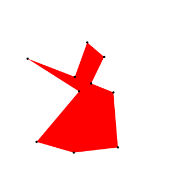

# randomPolys.js
Library for generating random polygons in javascript. 

A quick (and slightly dirty) way of generating pseudo-random, convex polygons for testing spatial applications.

Considerably faster than angle ordering as in Pavel Valtr's implementation (see “Probability that n random points are in convex position.”), particularly for larger numbers of points per polygon: https://jsben.ch/tBvX5.

Polygon examples:
10 Points: 

