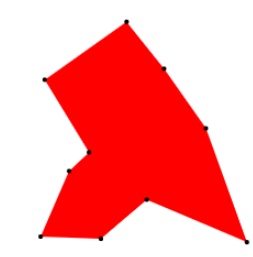
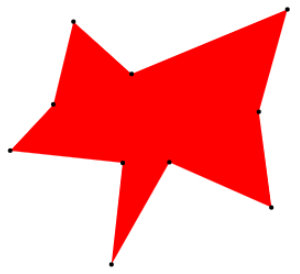

# randomPolys.js
Generate random polygons efficiently in javascript. 

A fast method of generating pseudo-random, convex polygons for testing spatial applications.

Considerably faster (albeit "less random") than angle ordering as in Pavel Valtr's "standard" implementation (see “Probability that n random points are in convex position.”, https://doi.org/10.1007/BF02574070), particularly for larger numbers of points per polygon: https://jsben.ch/bvkiU. Polygons are random enough for most purposes.


# Use
```javascript
var polygon = new RandomPolygon(count, max, epsilon);
```
<strong>epsilon</strong> can be set to adjust the "regularity" of the polygon, where a higher epsilon tends towards a square. Default value is 1.

# Polygon examples
10 Points: 

&nbsp; &nbsp; &nbsp; &nbsp; &nbsp; &nbsp; 
